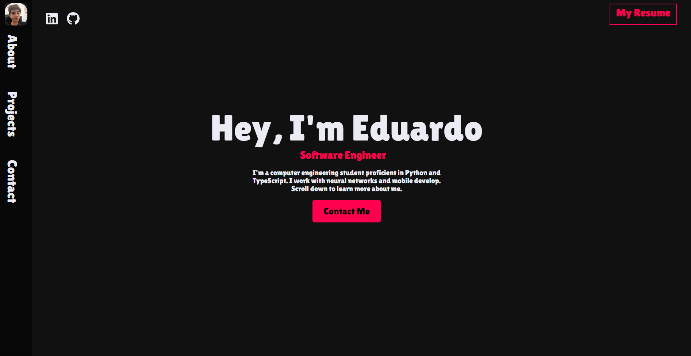
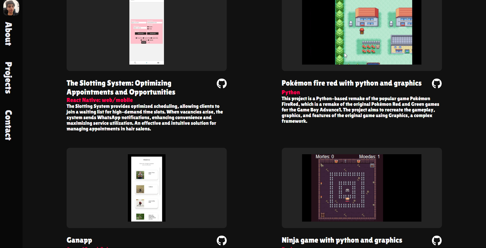

# [My Portfolio]

## Table of Contents
- [Introduction](#introduction)
- [Purpose](#purpose)
- [Problems Solved](#problems-solved)
- [Technologies Used](#technologies-used)
- [Usage](#usage)
- [Screenshots](#screenshots)
- [Credits](#credits)

## Introduction
Welcome to my personal portfolio repository! This project serves as a showcase of my skills, projects, and accomplishments in the field of computer engineering and software development.

## Purpose

The purpose of this portfolio is to provide a comprehensive view of my expertise, experiences, and projects to potential employers, collaborators, and anyone interested in my work. It serves as a centralized hub where I can highlight my technical abilities, share my achievements, and demonstrate my passion for programming and technology.

## Problems Solved

- **Effective Presentation:** Through this portfolio, I aim to present my skills and achievements in a visually appealing and organized manner, making it easier for others to understand the scope of my capabilities.

- **Showcasing Projects:** I can effectively showcase the projects I've worked on, whether they involve neural networks, React Native apps, or database development, allowing viewers to see the practical applications of my knowledge.

- **Professional Networking:** This portfolio enables me to connect with potential collaborators, mentors, and employers who share an interest in the technologies and fields I'm passionate about.

Whether you're a fellow developer, a potential employer, or someone curious about my journey in the world of technology, I hope my portfolio provides valuable insights into my skills and aspirations.

Feel free to explore the repository and learn more about my work!

## Technologies Used

- React
- React Bootstrap

## Screenshots

## Credits

This project was inspired by and based on the work of [Original Author's Name](https://github.com/Octrainn). I would like to express my gratitude for their contributions and the valuable resources they provided.

Original Repository: [Link to the Original Repository](https://github.com/Octrainn/Updated-Portfolio)

I've adapted and built upon their ideas to create my own version of the project. While I've made changes and additions to fit my needs, I'm indebted to their initial work that served as the foundation for this project.
